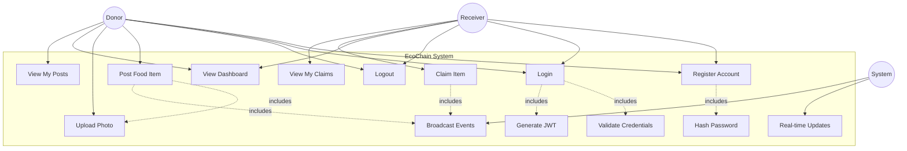

# Use Case Diagram

**Project:** EcoChain  
**Diagram Type:** Use Case  
**Version:** 1.0

---

## System Actors

| Actor        | Description                                             |
| ------------ | ------------------------------------------------------- |
| **Donor**    | Food retailers, bakeries, restaurants with surplus food |
| **Receiver** | Charities, food banks, community organizations          |
| **System**   | EcoChain platform (automated processes)                 |

---

## Use Case Diagram

---

## Use Case Descriptions

### UC1: Register Account

| Field             | Description                                                                                                                                           |
| ----------------- | ----------------------------------------------------------------------------------------------------------------------------------------------------- |
| **Actor**         | Donor, Receiver                                                                                                                                       |
| **Precondition**  | User has valid email                                                                                                                                  |
| **Main Flow**     | 1. User selects role (Donor/Receiver) 2. User enters email, name, password 3. Receiver enters Org ID 4. System validates and creates account |
| **Postcondition** | Account created, user can login                                                                                                                       |
| **Extensions**    | Email already exists → Show error                                                                                                                     |

---

### UC2: Login

| Field             | Description                                                                                                                              |
| ----------------- | ---------------------------------------------------------------------------------------------------------------------------------------- |
| **Actor**         | Donor, Receiver                                                                                                                          |
| **Precondition**  | User has registered account                                                                                                              |
| **Main Flow**     | 1. User enters email and password 2. System validates credentials 3. System generates JWT token 4. User redirected to dashboard |
| **Postcondition** | User authenticated, session active                                                                                                       |
| **Extensions**    | Invalid credentials → Show error                                                                                                         |

---

### UC4: Post Food Item

| Field             | Description                                                                                                                                                                             |
| ----------------- | --------------------------------------------------------------------------------------------------------------------------------------------------------------------------------------- |
| **Actor**         | Donor                                                                                                                                                                                   |
| **Precondition**  | User logged in as Donor                                                                                                                                                                 |
| **Main Flow**     | 1. Donor enters item name, quantity, expiry 2. Donor optionally uploads photo 3. System validates data 4. System saves item to database 5. System broadcasts to all clients |
| **Postcondition** | Item visible on all dashboards                                                                                                                                                          |
| **Extensions**    | Invalid expiry date → Show error                                                                                                                                                        |

---

### UC7: Claim Item

| Field             | Description                                                                                                                                                                                         |
| ----------------- | --------------------------------------------------------------------------------------------------------------------------------------------------------------------------------------------------- |
| **Actor**         | Receiver                                                                                                                                                                                            |
| **Precondition**  | User logged in as Receiver, item available                                                                                                                                                          |
| **Main Flow**     | 1. Receiver clicks Claim button 2. System validates item is available 3. System updates status to RESERVED 4. System links receiver to item 5. System broadcasts removal to all clients |
| **Postcondition** | Item claimed, removed from dashboards                                                                                                                                                               |
| **Extensions**    | Item already claimed → Show error                                                                                                                                                                   |

---

### UC6: View Dashboard

| Field             | Description                                                                                                                                                   |
| ----------------- | ------------------------------------------------------------------------------------------------------------------------------------------------------------- |
| **Actor**         | Donor, Receiver                                                                                                                                               |
| **Precondition**  | User logged in                                                                                                                                                |
| **Main Flow**     | 1. User navigates to dashboard 2. System fetches available items 3. System establishes WebSocket connection 4. Dashboard displays items in real-time |
| **Postcondition** | User sees live feed of items                                                                                                                                  |

---

## Actor-Use Case Matrix

| Use Case          | Donor | Receiver | System |
| ----------------- | :---: | :------: | :----: |
| Register Account  |   ✓   |    ✓     |        |
| Login             |   ✓   |    ✓     |        |
| Logout            |   ✓   |    ✓     |        |
| Post Food Item    |   ✓   |          |        |
| Upload Photo      |   ✓   |          |        |
| View Dashboard    |   ✓   |    ✓     |        |
| Claim Item        |       |    ✓     |        |
| View My Posts     |   ✓   |          |        |
| View My Claims    |       |    ✓     |        |
| Real-time Updates |       |          |   ✓    |
| Broadcast Events  |       |          |   ✓    |

---

_Use Case Diagram - EcoChain Design Phase_
