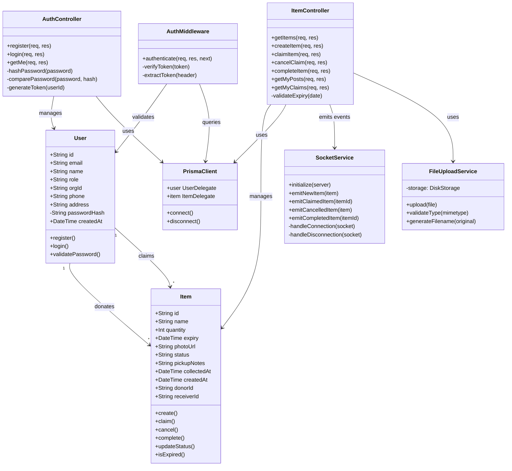
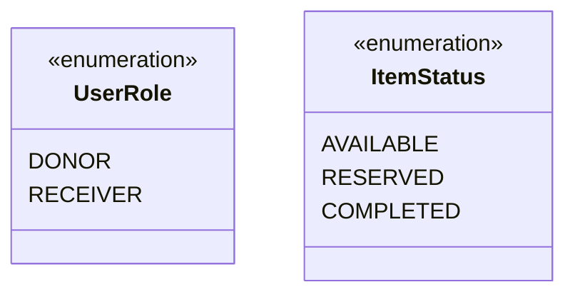

# Class Diagram

**Project:** EcoChain  
**Diagram Type:** Class  
**Version:** 2.0  
**Last Updated:** January 3, 2026

---

## Class Diagram

---

## Class Descriptions

### Domain Classes

#### User

| Attribute    | Type          | Description                       |
| ------------ | ------------- | --------------------------------- |
| id           | String (UUID) | Primary key                       |
| email        | String        | Unique email address              |
| name         | String        | Display name / business name      |
| role         | Enum          | DONOR or RECEIVER                 |
| orgId        | String?       | Organization ID (receivers only)  |
| phone        | String?       | Contact phone number              |
| address      | String?       | Collection location (donors only) |
| passwordHash | String        | Bcrypt hashed password            |
| createdAt    | DateTime      | Registration timestamp            |

#### Item

| Attribute   | Type          | Description                    |
| ----------- | ------------- | ------------------------------ |
| id          | String (UUID) | Primary key                    |
| name        | String        | Food item name                 |
| quantity    | Integer       | Number of units                |
| expiry      | DateTime      | Expiration date                |
| photoUrl    | String?       | Path to uploaded photo         |
| status      | Enum          | AVAILABLE, RESERVED, COMPLETED |
| pickupNotes | String?       | Collection/pickup instructions |
| collectedAt | DateTime?     | When the item was collected    |
| donorId     | String (FK)   | Reference to donor User        |
| receiverId  | String? (FK)  | Reference to claiming receiver |

---

### Controller Classes

#### AuthController

| Method   | Parameters | Returns | Description                 |
| -------- | ---------- | ------- | --------------------------- |
| register | req, res   | 201/400 | Create new user account     |
| login    | req, res   | 200/401 | Authenticate and return JWT |
| getMe    | req, res   | 200/401 | Get current user from token |

#### ItemController

| Method       | Parameters | Returns     | Description                      |
| ------------ | ---------- | ----------- | -------------------------------- |
| getItems     | req, res   | 200         | List all available items         |
| createItem   | req, res   | 201/400     | Create new food item             |
| claimItem    | req, res   | 200/400/404 | Claim an available item          |
| cancelClaim  | req, res   | 200/400/404 | Cancel a reservation (receiver)  |
| completeItem | req, res   | 200/400/404 | Mark item as collected/completed |
| getMyPosts   | req, res   | 200         | Get donor's posted items         |
| getMyClaims  | req, res   | 200         | Get receiver's claimed items     |

---

### Service Classes

#### SocketService

| Method                    | Description                      |
| ------------------------- | -------------------------------- |
| initialize(server)        | Attach Socket.io to HTTP server  |
| emitNewItem(item)         | Broadcast `item:new` event       |
| emitClaimedItem(itemId)   | Broadcast `item:claimed` event   |
| emitCancelledItem(item)   | Broadcast `item:cancelled` event |
| emitCompletedItem(itemId) | Broadcast `item:completed` event |

#### FileUploadService

| Method                     | Description                    |
| -------------------------- | ------------------------------ |
| upload(file)               | Save file to disk, return path |
| validateType(mimetype)     | Check if JPEG or PNG           |
| generateFilename(original) | Create unique filename         |

---

## Relationships

| Relationship                   | Type        | Description                       |
| ------------------------------ | ----------- | --------------------------------- |
| User → Item (donates)          | 1:N         | One donor can post many items     |
| User → Item (claims)           | 1:N         | One receiver can claim many items |
| AuthController → User          | Association | Manages user operations           |
| ItemController → Item          | Association | Manages item operations           |
| Controllers → PrismaClient     | Dependency  | Database operations               |
| ItemController → SocketService | Dependency  | Real-time events                  |

---

## Enumerations

---

_Class Diagram - EcoChain Design Phase_
