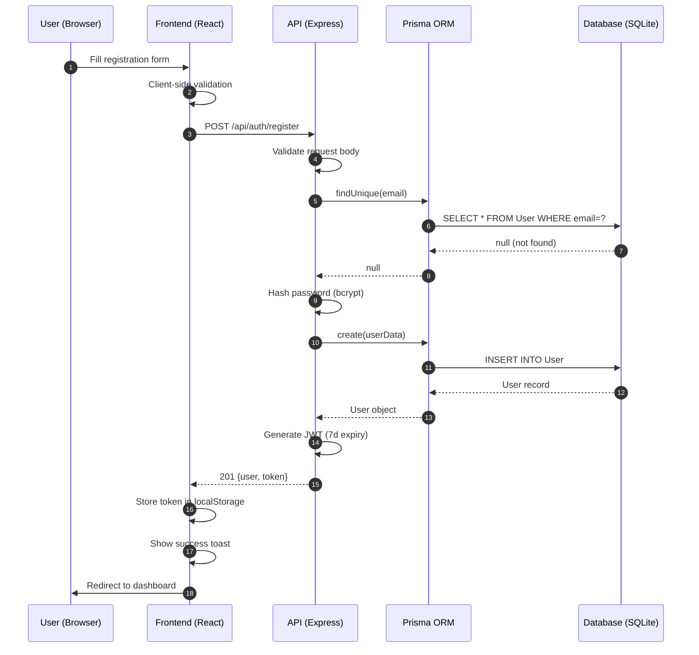
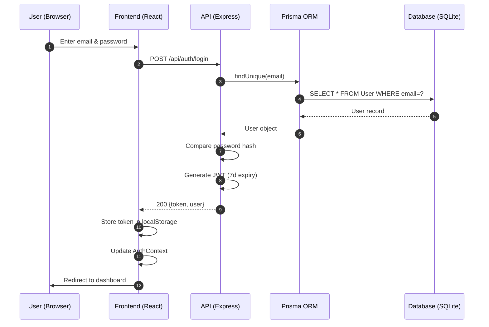
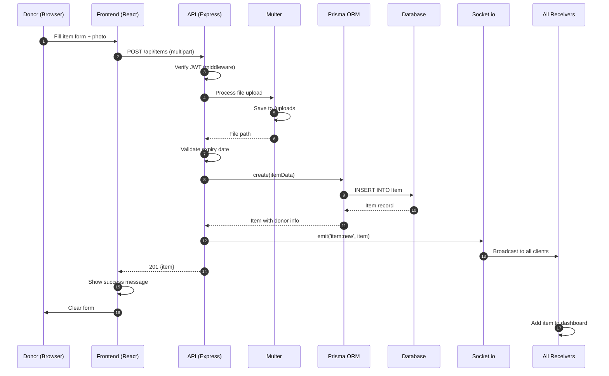
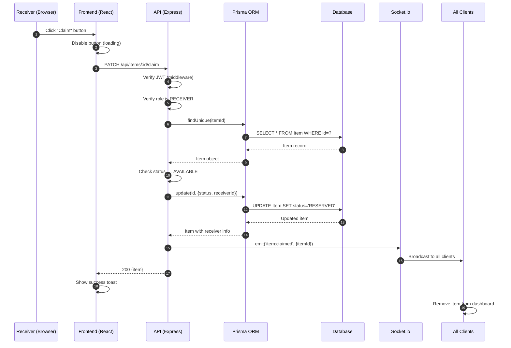
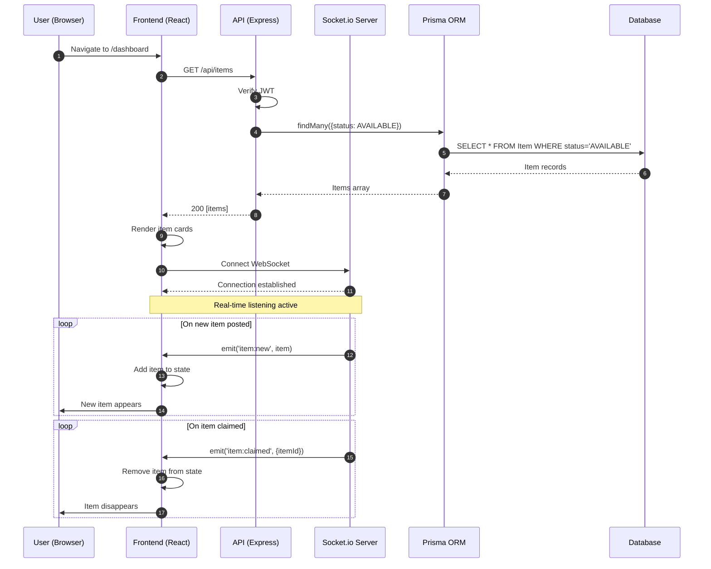
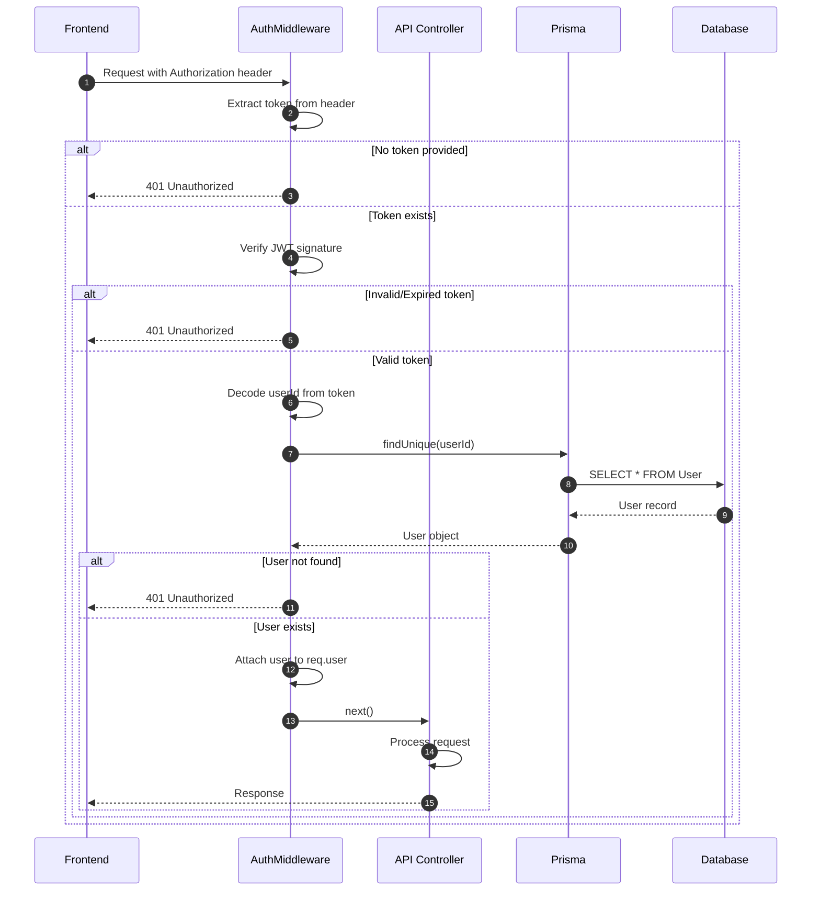
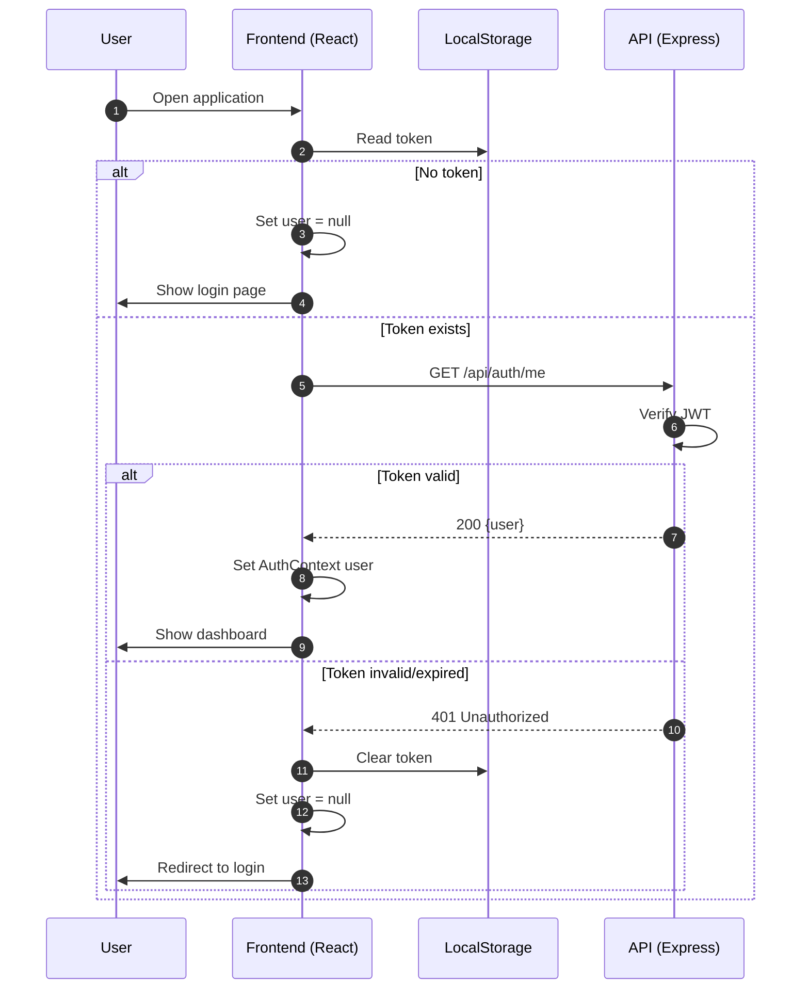
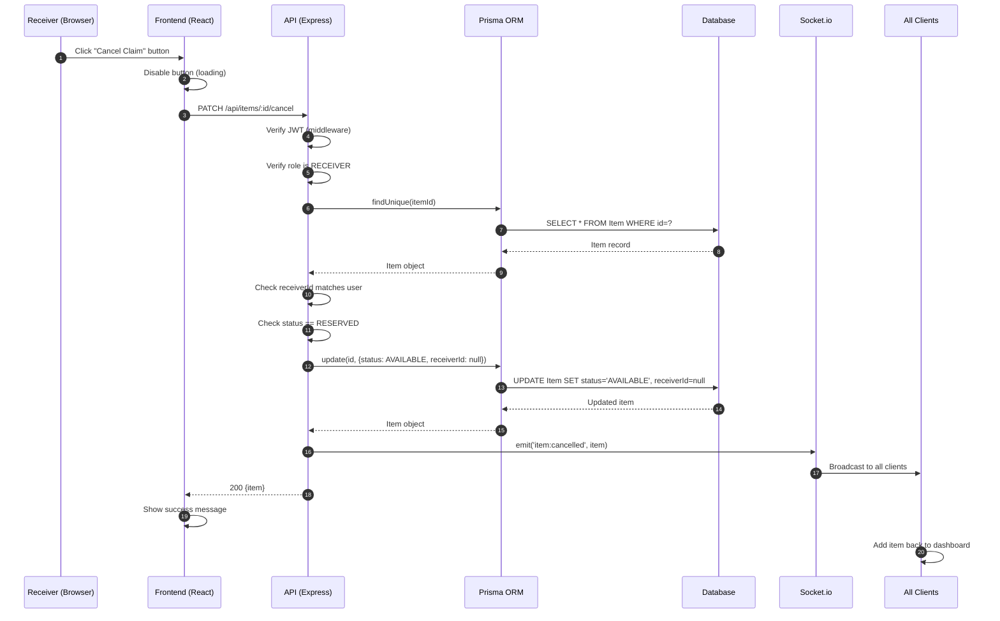
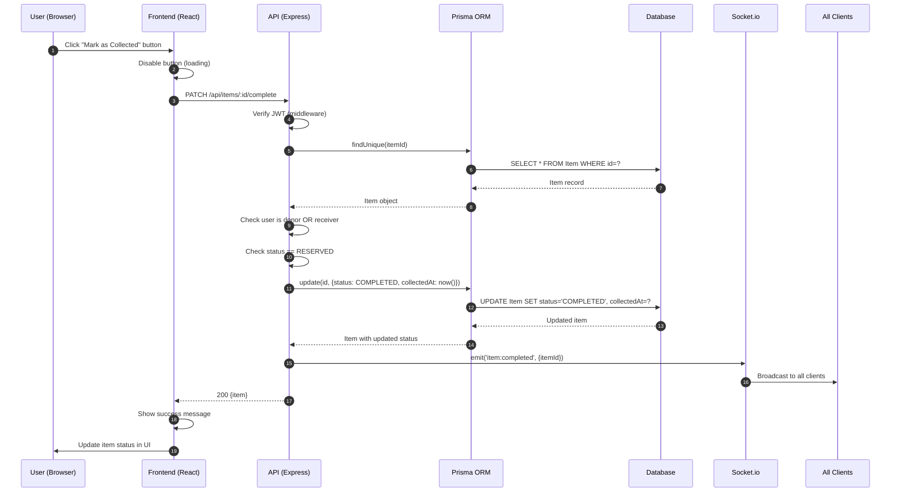

# Sequence Diagrams

**Project:** EcoChain  
**Diagram Type:** Sequence  
**Version:** 2.0  
**Last Updated:** January 3, 2026

---

## 1. User Registration Sequence

---

## 2. User Login Sequence

---

## 3. Post Food Item Sequence

---

## 4. Claim Item Sequence

---

## 5. Real-Time Dashboard Sequence

---

## 6. JWT Authentication Middleware Sequence

---

## 7. Session Restoration Sequence

---

## 8. Cancel Claim Sequence

---

## 9. Complete Item (Mark as Collected) Sequence

---

## Sequence Summary

| Diagram         | Primary Flow                      | Key Interactions              |
| --------------- | --------------------------------- | ----------------------------- |
| Registration    | User → Frontend → API → DB        | Password hashing, validation  |
| Login           | User → API → DB → JWT             | Token generation, storage     |
| Post Item       | Donor → API → DB → Socket         | File upload, broadcast        |
| Claim Item      | Receiver → API → DB → Socket      | Status update, broadcast      |
| Dashboard       | User → API → Socket               | Initial load + real-time      |
| Auth Middleware | Request → Middleware → Controller | Token verification            |
| Session Restore | App Load → Storage → API          | Token validation              |
| Cancel Claim    | Receiver → API → DB → Socket      | Release item, broadcast       |
| Complete Item   | User → API → DB → Socket          | Mark collected, set timestamp |

---

_Sequence Diagrams - EcoChain Design Phase_
