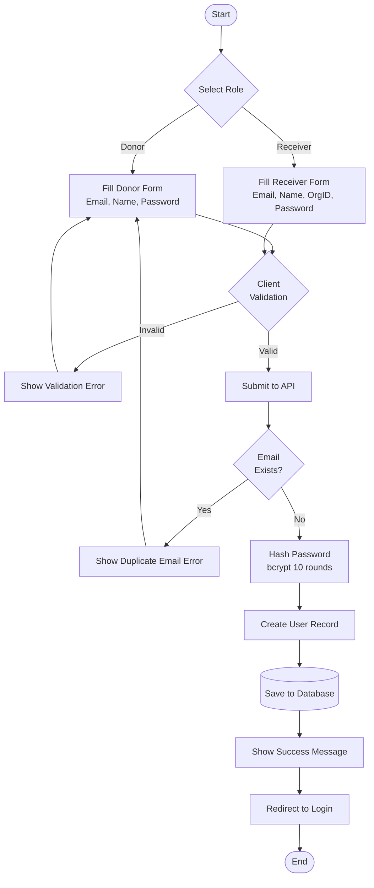
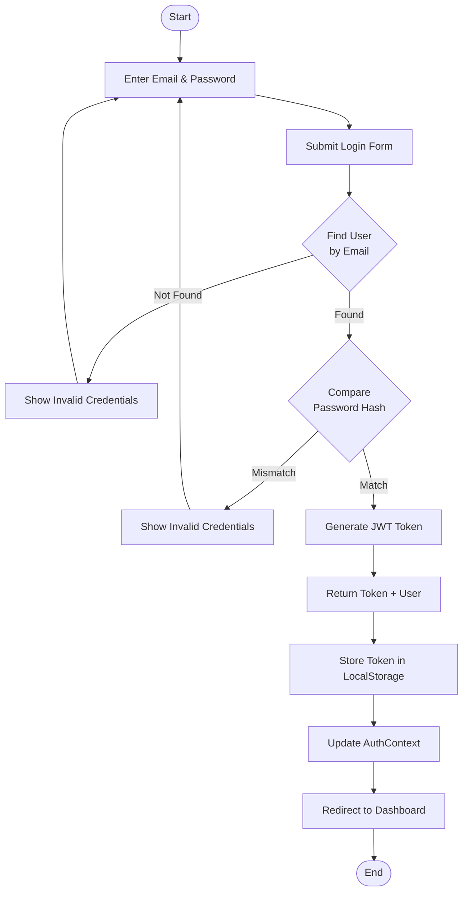
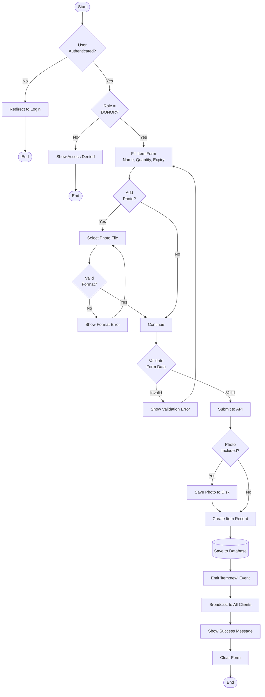
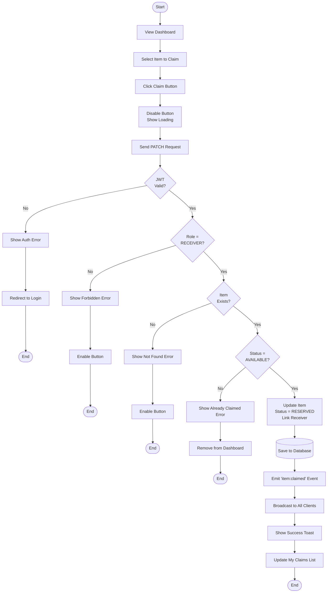
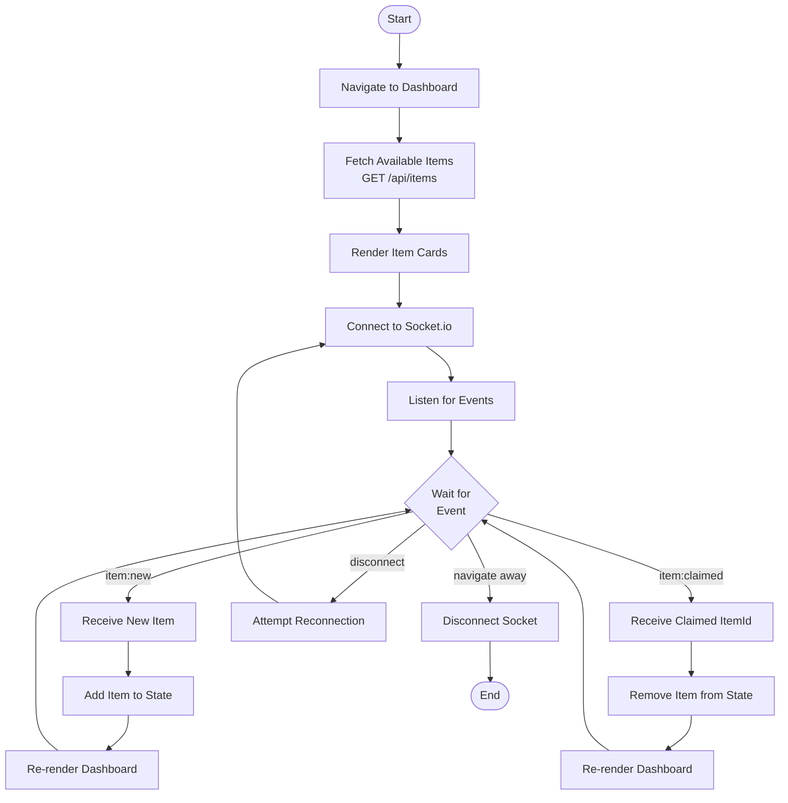
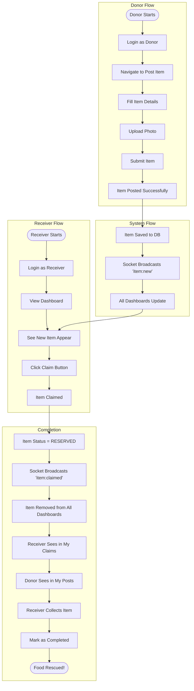
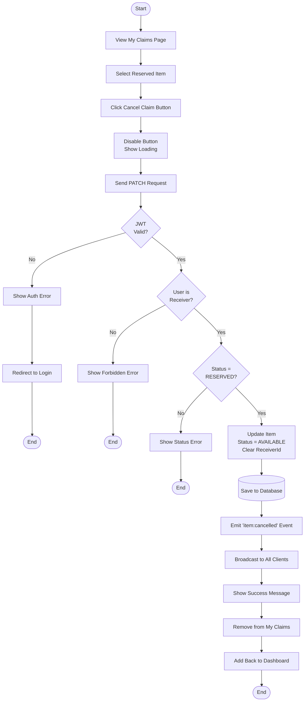
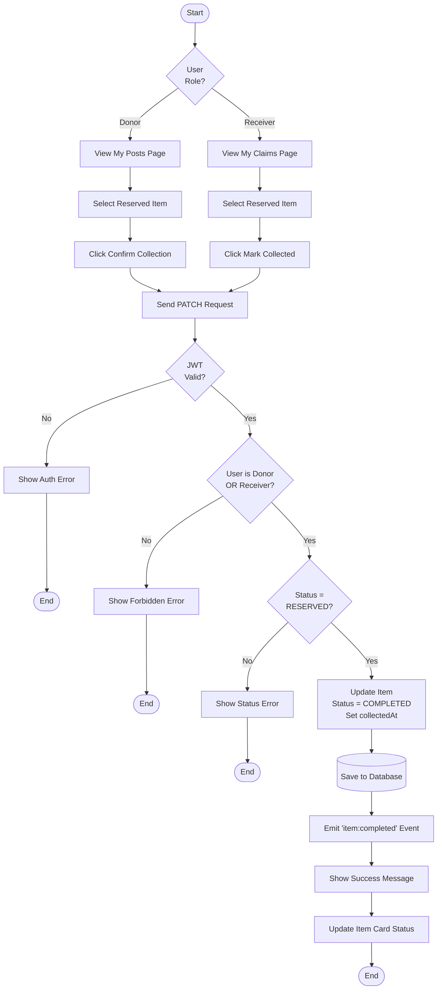

# Activity Diagrams

**Project:** EcoChain  
**Diagram Type:** Activity  
**Version:** 2.0  
**Last Updated:** January 3, 2026

---

## 1. User Registration Activity

---

## 2. User Login Activity

---

## 3. Post Food Item Activity

---

## 4. Claim Item Activity

---

## 5. Real-Time Dashboard Activity

---

## 6. Complete Food Rescue Cycle

---

## 7. Cancel Reservation Activity

---

## 8. Mark as Collected/Completed Activity

---

## Activity Summary

| Activity       | Actors           | Key Decision Points                 |
| -------------- | ---------------- | ----------------------------------- |
| Registration   | User, System     | Role selection, email uniqueness    |
| Login          | User, System     | Credential validation               |
| Post Item      | Donor, System    | Photo upload, data validation       |
| Claim Item     | Receiver, System | Availability check, role validation |
| Dashboard      | User, System     | Real-time event handling            |
| Full Cycle     | All              | Complete donation workflow          |
| Cancel Claim   | Receiver, System | Ownership check, status validation  |
| Mark Completed | Donor/Receiver   | Permission check, status update     |

---

_Activity Diagrams - EcoChain Design Phase_
