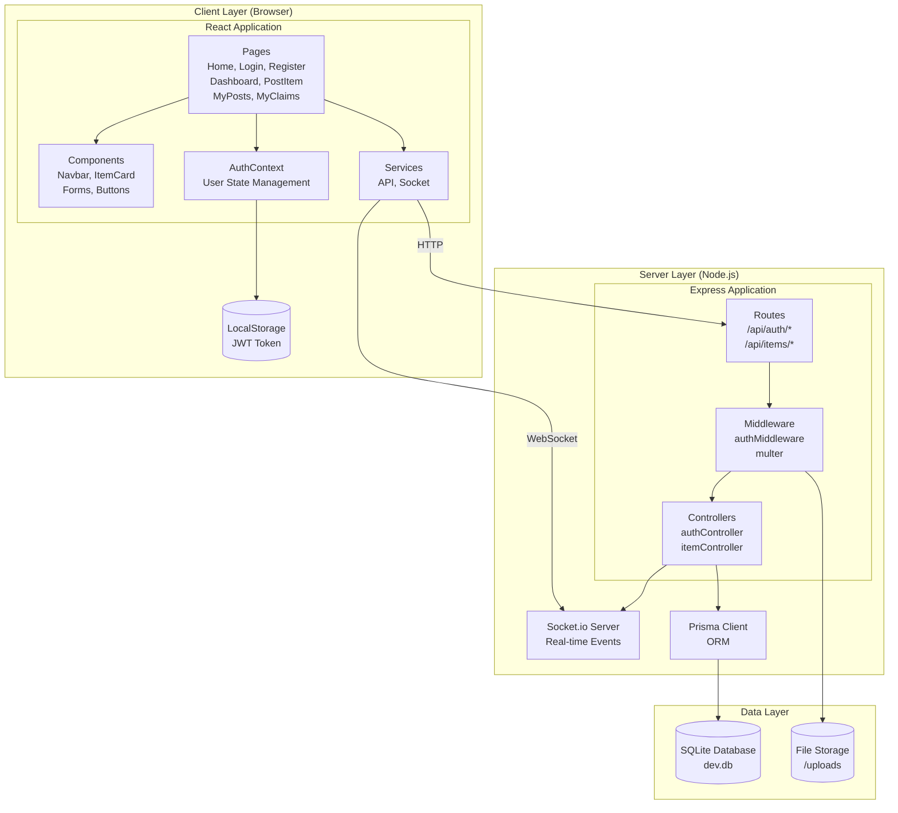
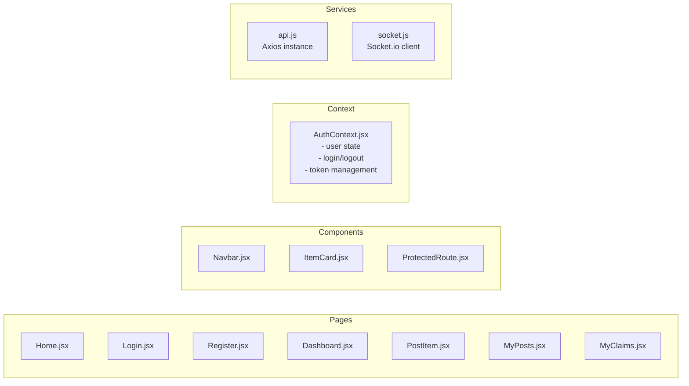
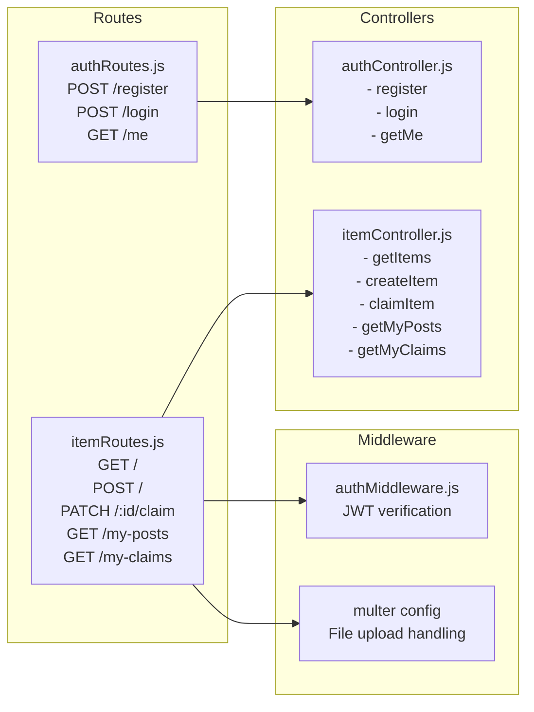
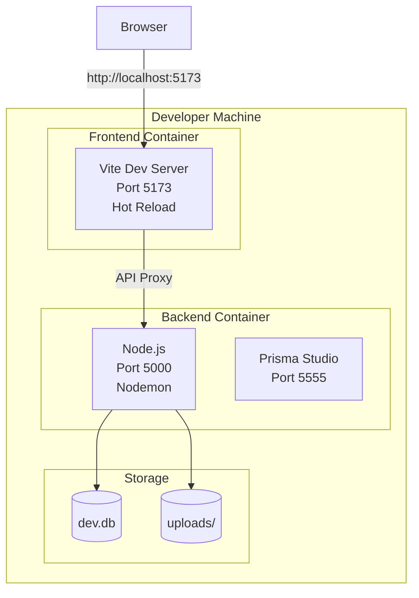
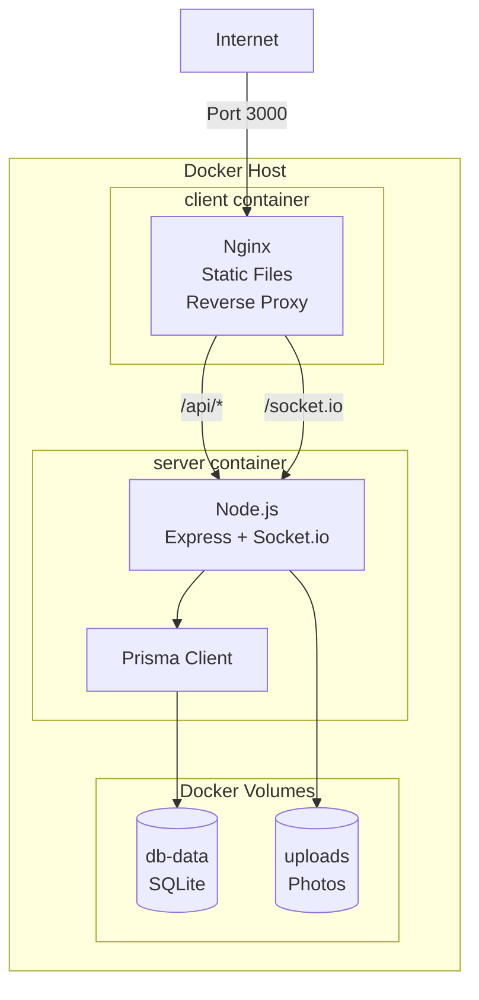
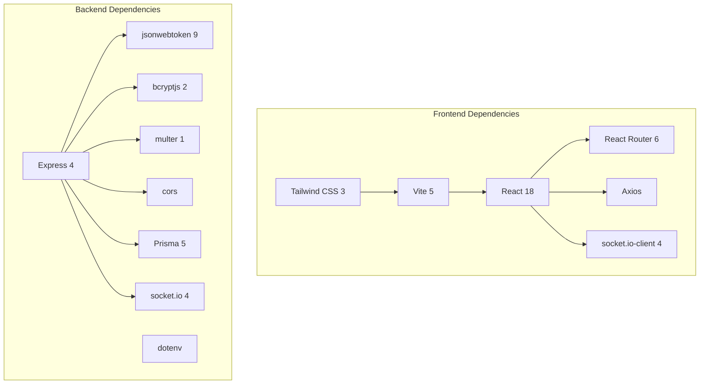

# Component Diagram

**Project:** EcoChain  
**Diagram Type:** Component  
**Version:** 1.0

---

## System Architecture

---

## Component Details

### Client Layer

### Server Layer

---

## Deployment Architecture

### Development Mode

### Production Mode (Docker)

---

## Interface Specifications

### REST API Interface

| Endpoint             | Method | Request                                  | Response      |
| -------------------- | ------ | ---------------------------------------- | ------------- |
| /api/auth/register   | POST   | {email, name, password, role, orgId?}    | {user, token} |
| /api/auth/login      | POST   | {email, password}                        | {token, user} |
| /api/auth/me         | GET    | Header: Authorization                    | {user}        |
| /api/items           | GET    | Header: Authorization                    | [{item}]      |
| /api/items           | POST   | FormData: name, quantity, expiry, photo? | {item}        |
| /api/items/:id/claim | PATCH  | Header: Authorization                    | {item}        |

### WebSocket Interface

| Event        | Direction       | Payload  | Description          |
| ------------ | --------------- | -------- | -------------------- |
| connection   | Client → Server | -        | Establish connection |
| item:new     | Server → Client | {item}   | New item posted      |
| item:claimed | Server → Client | {itemId} | Item claimed         |
| disconnect   | Client → Server | -        | Connection closed    |

---

## Dependency Graph

---

_Component Diagram - EcoChain Design Phase_
