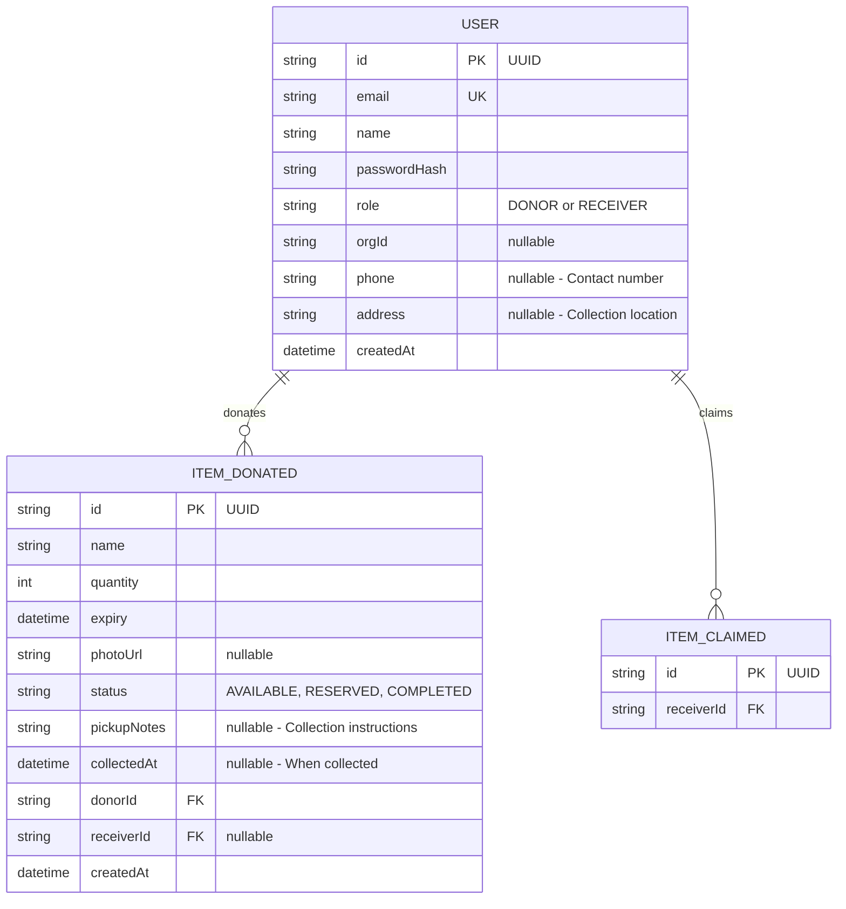
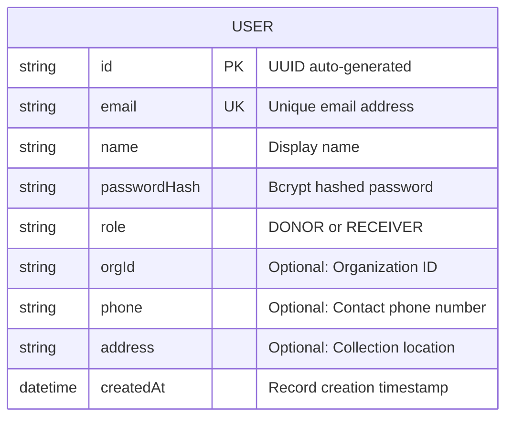
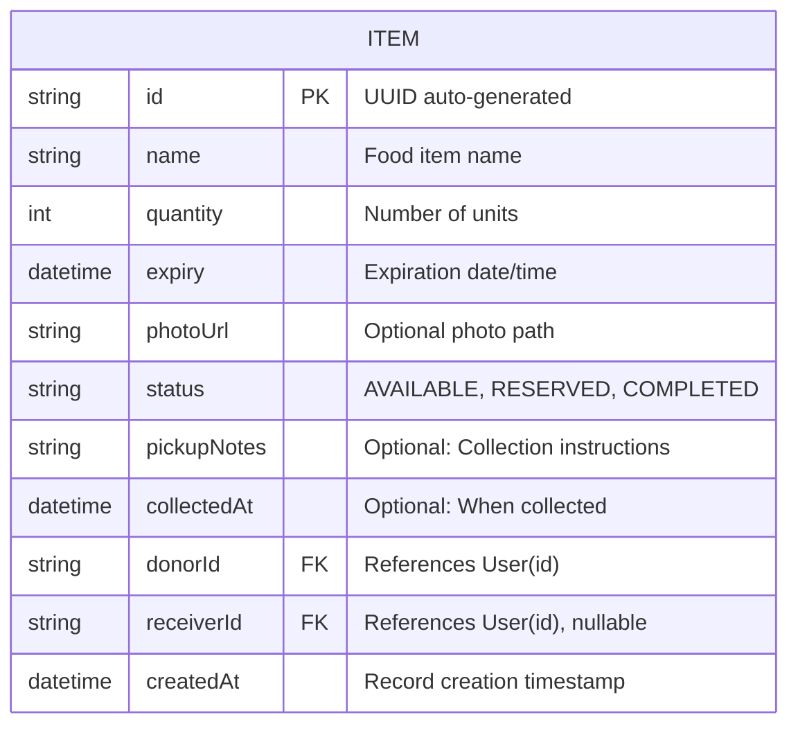
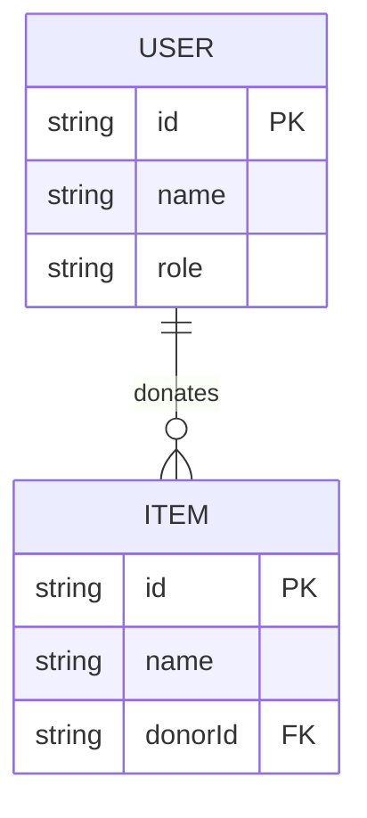
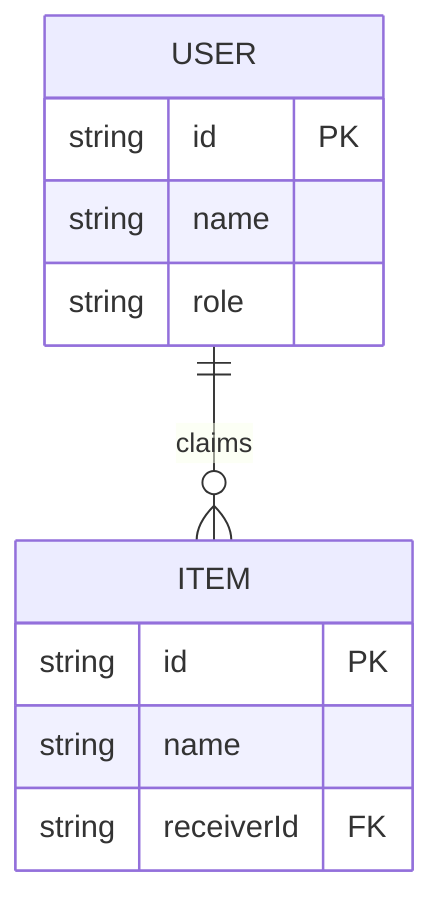
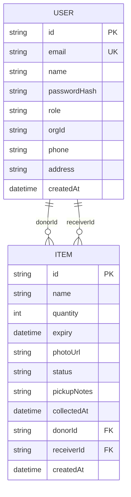

# Entity-Relationship Diagram

**Project:** EcoChain  
**Diagram Type:** ER (Entity-Relationship)  
**Version:** 2.0  
**Last Updated:** January 3, 2026

---

## Database Schema Overview



---

## Detailed Entity Definitions

### USER Entity



| Attribute    | Type     | Constraints      | Description                             |
| ------------ | -------- | ---------------- | --------------------------------------- |
| id           | String   | PK, UUID         | Unique user identifier                  |
| email        | String   | Unique, Not Null | User login email                        |
| name         | String   | Not Null         | User display name                       |
| passwordHash | String   | Not Null         | Bcrypt hashed (10 rounds)               |
| role         | String   | Not Null         | "DONOR" or "RECEIVER"                   |
| orgId        | String   | Nullable         | Organization identifier (for receivers) |
| phone        | String   | Nullable         | Contact phone number                    |
| address      | String   | Nullable         | Collection/pickup location (for donors) |
| createdAt    | DateTime | Default: now()   | Creation timestamp                      |

---

### ITEM Entity



| Attribute   | Type     | Constraints            | Description                       |
| ----------- | -------- | ---------------------- | --------------------------------- |
| id          | String   | PK, UUID               | Unique item identifier            |
| name        | String   | Not Null               | Name of food item                 |
| quantity    | Int      | Not Null               | Quantity available                |
| expiry      | DateTime | Not Null               | Item expiration date              |
| photoUrl    | String   | Nullable               | Path to uploaded photo            |
| status      | String   | Default: "AVAILABLE"   | Current item status               |
| pickupNotes | String   | Nullable               | Collection/pickup instructions    |
| collectedAt | DateTime | Nullable               | Timestamp when item was collected |
| donorId     | String   | FK → User.id, Not Null | Donor who posted                  |
| receiverId  | String   | FK → User.id, Nullable | Receiver who claimed              |
| createdAt   | DateTime | Default: now()         | Creation timestamp                |

---

## Relationships

### One-to-Many: User → Items (as Donor)



- **Cardinality:** 1:N (One User can donate Many Items)
- **Participation:** Partial (A User may have 0 donated items)
- **FK:** `Item.donorId` → `User.id`

---

### One-to-Many: User → Items (as Receiver)



- **Cardinality:** 1:N (One User can claim Many Items)
- **Participation:** Partial (A User may have 0 claimed items)
- **FK:** `Item.receiverId` → `User.id`

---

## Complete Database Schema



---

## Prisma Schema Reference

```prisma
// User model
model User {
  id           String   @id @default(uuid())
  email        String   @unique
  name         String
  role         String   // "DONOR" or "RECEIVER"
  orgId        String?  // Only for Receivers
  phone        String?  // Contact phone number
  address      String?  // Collection location (for donors)
  passwordHash String
  createdAt    DateTime @default(now())

  // Relations
  donatedItems Item[]   @relation("DonorItems")
  claimedItems Item[]   @relation("ReceiverItems")
}

// Item model
model Item {
  id          String    @id @default(uuid())
  name        String
  quantity    Int
  expiry      DateTime
  photoUrl    String?
  status      String    @default("AVAILABLE") // "AVAILABLE", "RESERVED", "COMPLETED"
  pickupNotes String?   // Collection instructions
  collectedAt DateTime? // When actually collected
  createdAt   DateTime  @default(now())

  // Relations
  donor      User     @relation("DonorItems", fields: [donorId], references: [id])
  donorId    String
  receiver   User?    @relation("ReceiverItems", fields: [receiverId], references: [id])
  receiverId String?
}
```

---

## Data Dictionary

### Value Constraints

| Field       | Valid Values                         | Description             |
| ----------- | ------------------------------------ | ----------------------- |
| User.role   | "DONOR", "RECEIVER"                  | User role in the system |
| Item.status | "AVAILABLE", "RESERVED", "COMPLETED" | Item lifecycle status   |

> **Note:** The system uses String fields with application-level validation rather than database-level enums for flexibility.

### Indexes

| Table | Column(s)  | Type    | Purpose                      |
| ----- | ---------- | ------- | ---------------------------- |
| User  | id         | Primary | Record identification (UUID) |
| User  | email      | Unique  | Fast login lookup            |
| Item  | id         | Primary | Record identification (UUID) |
| Item  | donorId    | Foreign | Join with User               |
| Item  | receiverId | Foreign | Join with User               |

### Constraints

| Constraint       | Table | Rule                                      |
| ---------------- | ----- | ----------------------------------------- |
| FK_Item_Donor    | Item  | donorId REFERENCES User(id)               |
| FK_Item_Receiver | Item  | receiverId REFERENCES User(id) (nullable) |
| App_Role         | User  | role validated at application level       |
| App_Status       | Item  | status validated at application level     |

---

_Entity-Relationship Diagram - EcoChain Design Phase_
