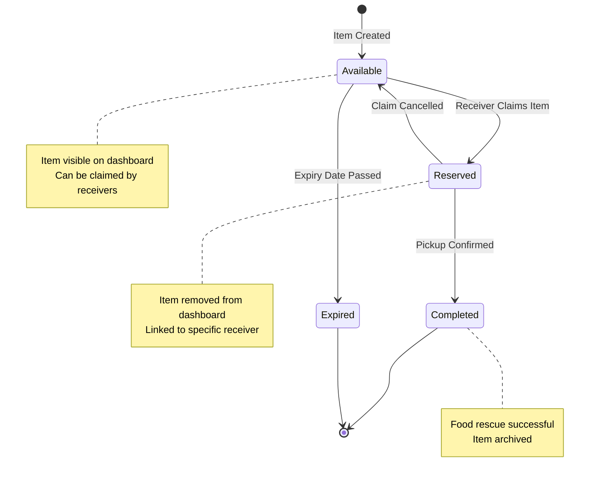
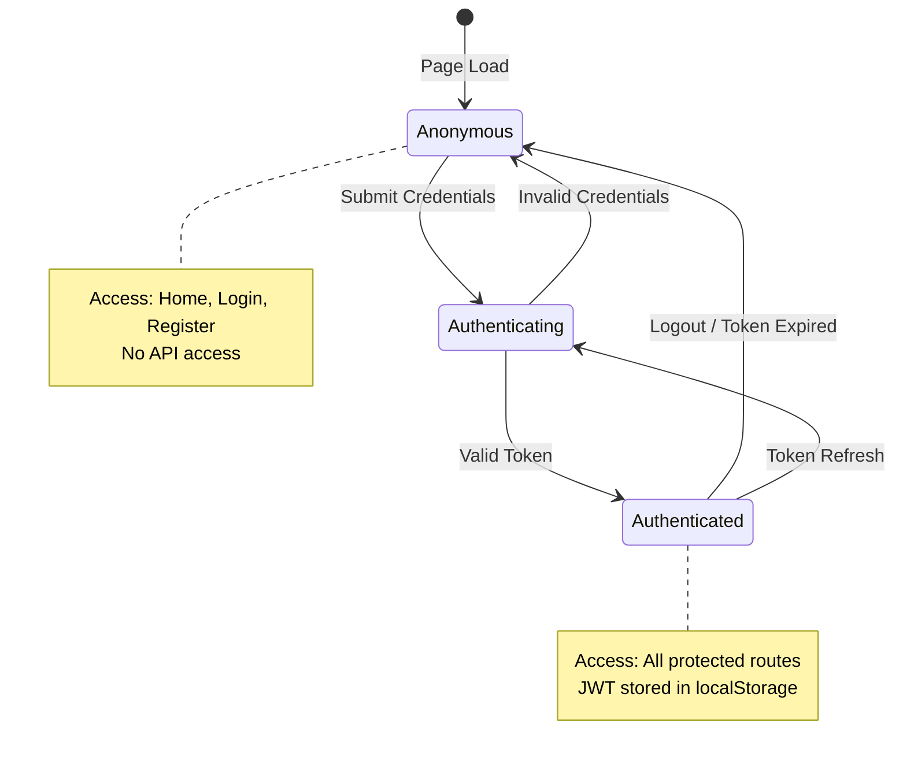
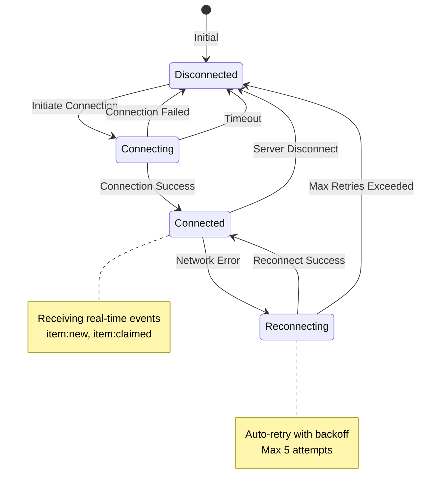
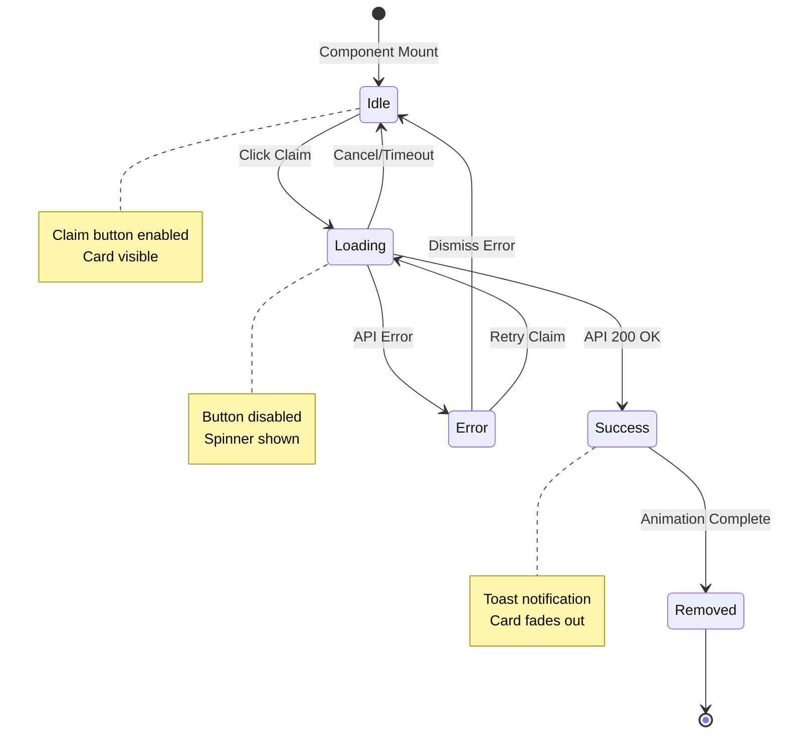
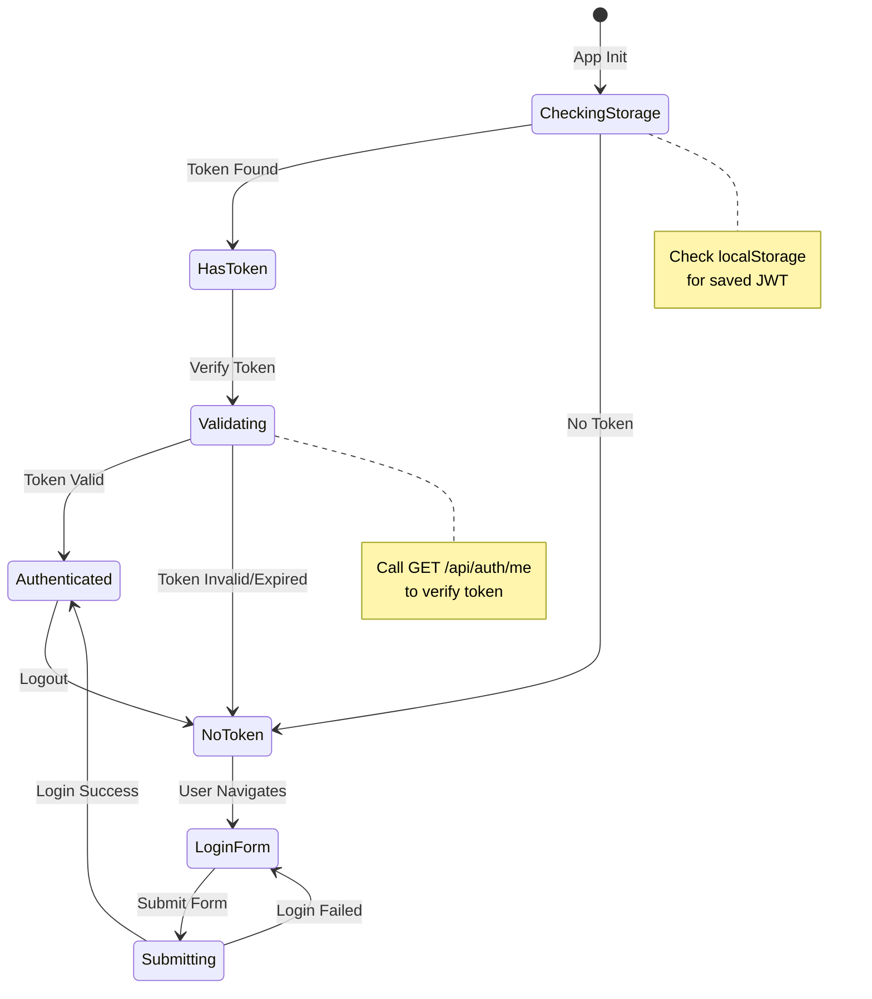
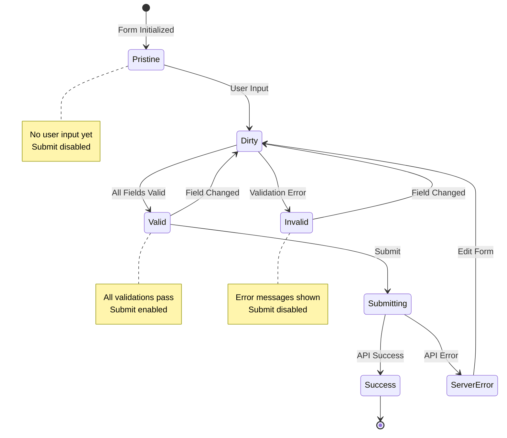
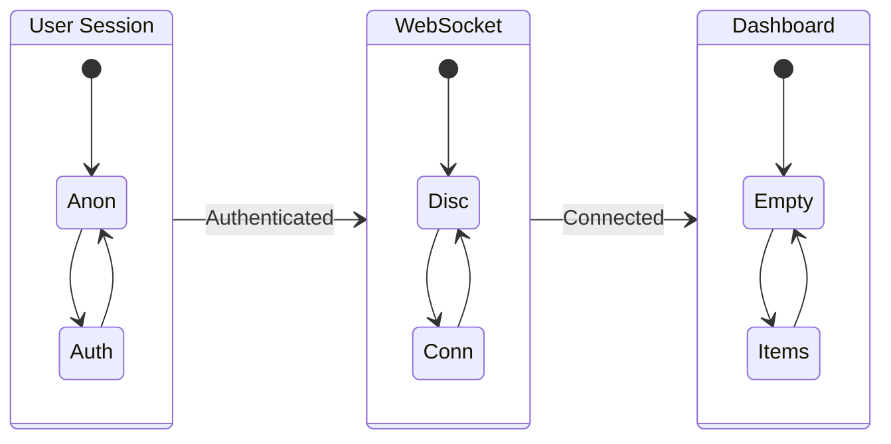

# State Diagrams

**Project:** EcoChain  
**Diagram Type:** State  
**Version:** 1.0

---

## 1. Item Lifecycle State Machine

### State Descriptions

| State         | Description                                 | Transitions                                 |
| ------------- | ------------------------------------------- | ------------------------------------------- |
| **Available** | Item is posted and visible to all receivers | → Reserved (claimed), → Expired (time)      |
| **Reserved**  | Item claimed by a receiver, pending pickup  | → Completed (confirm), → Available (cancel) |
| **Completed** | Food successfully rescued                   | Terminal state                              |
| **Expired**   | Item passed expiry date unclaimed           | Terminal state                              |

---

## 2. User Session State Machine

### State Descriptions

| State              | Description                   | Available Actions          |
| ------------------ | ----------------------------- | -------------------------- |
| **Anonymous**      | User not logged in            | View home, Login, Register |
| **Authenticating** | Credentials being verified    | Wait for response          |
| **Authenticated**  | User logged in with valid JWT | All app features           |

---

## 3. WebSocket Connection State Machine

### State Descriptions

| State            | Description               | Next Actions      |
| ---------------- | ------------------------- | ----------------- |
| **Disconnected** | No WebSocket connection   | Attempt connect   |
| **Connecting**   | Handshake in progress     | Wait for result   |
| **Connected**    | Active real-time channel  | Listen for events |
| **Reconnecting** | Lost connection, retrying | Auto-retry        |

---

## 4. Item Card UI State Machine

### State Descriptions

| State       | Description                | UI Display                  |
| ----------- | -------------------------- | --------------------------- |
| **Idle**    | Card ready for interaction | Claim button active         |
| **Loading** | API request in progress    | Spinner, button disabled    |
| **Success** | Item claimed successfully  | Success toast               |
| **Error**   | Claim failed               | Error message, retry option |
| **Removed** | Card removed from DOM      | Not visible                 |

---

## 5. Authentication Flow State Machine

---

## 6. Form Validation State Machine

---

## State Transition Tables

### Item Status Transitions

| Current State | Event      | Next State | Guard Conditions        |
| ------------- | ---------- | ---------- | ----------------------- |
| AVAILABLE     | claim()    | RESERVED   | User.role == RECEIVER   |
| AVAILABLE     | expire()   | EXPIRED    | now() > expiresAt       |
| RESERVED      | complete() | COMPLETED  | Valid receiver confirms |
| RESERVED      | cancel()   | AVAILABLE  | Within time limit       |

### User Session Transitions

| Current State  | Event          | Next State     | Actions               |
| -------------- | -------------- | -------------- | --------------------- |
| Anonymous      | login(creds)   | Authenticating | POST /api/auth/login  |
| Authenticating | success(token) | Authenticated  | Store token, redirect |
| Authenticating | failure(error) | Anonymous      | Show error            |
| Authenticated  | logout()       | Anonymous      | Clear token, redirect |

---

## Combined System State

---

_State Diagrams - EcoChain Design Phase_
